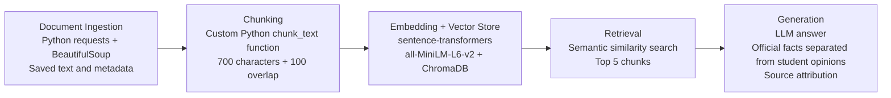

# Project 1 Planning: The Unofficial Guide

> Write this document before you write any pipeline code.
> Your spec and architecture diagram are what you'll use to direct AI tools (Claude, Copilot, etc.) to generate your implementation — the more specific they are, the more useful the generated code will be.
> Update the Retrieval Approach and Chunking Strategy sections if you change your approach during implementation.
> Update this file before starting any stretch features.

---

## Domain

I chose **UCSD campus dining experiences and practical food advice for students**.

This domain is useful because students need more than a list of restaurants. They often want to know how Dining Dollars and Triton Cash differ, which locations are worth trying, how to budget a dining plan, what campus markets sell, and how to avoid wasting leftover Dining Dollars.

Some official information exists, but practical advice is scattered across UCSD pages and student discussions. Official pages explain rules and locations, while Reddit threads provide details that are harder to find through official channels, such as specific meal recommendations, line-length complaints, affordable options, dorm-cooking ideas, and strategies for using leftover Dining Dollars. My guide will combine both types of sources while clearly separating official facts from student opinions.
---

## Documents

I will use a mixture of official UCSD pages and student-created Reddit threads. The official pages provide reliable information about dining policies, account types, locations, and budgeting. The Reddit threads add practical recommendations and student perspectives.

| # | Source | Description | URL or location |
|---|--------|-------------|-----------------|
| 1 | Dining Plans at UC San Diego | Official explanation of the à la carte dining-plan system, Dining Dollars, and Triton Cash. | https://hdhdining.ucsd.edu/dining-plans/index.html |
| 2 | Dining Dollars FAQ | Official answers about where Dining Dollars and Triton Cash can be used. | https://hdhdining.ucsd.edu/dining-plans/dining-dollars-faq.html |
| 3 | Budgeting Dining Dollars and Triton Cash | Official budgeting advice, including saving Triton Cash for breaks and holidays. | https://hdhdining.ucsd.edu/dining-plans/budgeting.html |
| 4 | Incoming Student Dining Plan | Official incoming-student plan options and examples of who each plan fits. | https://hdhdining.ucsd.edu/dining-plans/incoming.html |
| 5 | Continuing Student Dining Plan | Official continuing-student dining-plan options and estimated daily spending amounts. | https://hdhdining.ucsd.edu/dining-plans/continuing.html |
| 6 | Dining @ UCSD | Official overview of restaurants, cafés, student dining facilities, and campus stores. | https://students.ucsd.edu/campus-services/dining/index.html |
| 7 | Places to Eat at UCSD | Official list of dining locations, descriptions, and operating hours. | https://blink.ucsd.edu/facilities/services/general/personal/dining.html |
| 8 | University Centers Dining & Retail | Official list of Price Center and Student Center dining options, including locations that accept Triton Cash. | https://universitycenters.ucsd.edu/dining-and-retail/index.html |
| 9 | Leftover Dining Dollars to Spend, Where Should I? | Student recommendations for specific foods and locations, including Foodworx deep-dish pizza and Makai. | https://www.reddit.com/r/UCSD/comments/1o7u0nz/leftover_dining_dollars_to_spend_where_should_i/ |
| 10 | What Are Some Meals That You Could Make in Your Dorm? | Student suggestions for dorm cooking and ingredients sold in campus markets. | https://www.reddit.com/r/UCSD/comments/15hllj4/what_are_some_meals_that_you_could_make_in_your/ |
| 11 | Any Healthy Cheap Options on Campus? | Student advice for eating more affordably and using campus markets for ingredients. | https://www.reddit.com/r/UCSD/comments/1foyncf/any_healthy_cheap_options_on_campus/ |
| 12 | What Are Your Overall Thoughts on the Quality of Dining Hall Food? | Student opinions about dining-hall food quality, pricing, and Price Center alternatives. | https://www.reddit.com/r/UCSD/comments/t1nskq/what_are_your_overall_thoughts_on_the_quality_of/ |
| 13 | How Am I Supposed to Spend Almost $3000 Dining Dollars? | Student discussion about using leftover Dining Dollars at markets or donating food. | https://www.reddit.com/r/UCSD/comments/1hbnk4y/how_am_i_supposed_to_spend_almost_3000_dining/ |
| 14 | Market Pricing? | Student discussion comparing campus-market prices with off-campus prices. | https://www.reddit.com/r/UCSD/comments/qvmsu7/market_pricing/ |

---

## Chunking Strategy

**Chunk size:** Approximately **700 characters** maximum per chunk.

**Overlap:** **100 characters** between adjacent chunks when a section is longer than the maximum size.

**Reasoning:**
My corpus contains two main document types: official UCSD pages and student Reddit threads. For official pages, I will split text by heading and paragraph first, then apply the 700-character limit only when a section is still too long. This should keep related facts together, such as an explanation of Dining Dollars and Triton Cash.

For Reddit threads, I will preserve each post or comment as its own chunk whenever possible. Short comments should stay intact even if they are below 700 characters because the full comment usually contains one opinion or recommendation. Longer comments will be split with a 100-character overlap.

The overlap helps preserve facts that span a boundary. For example, one chunk might introduce a restaurant name while the next sentence explains why a student recommends it. Without overlap, retrieval could return only half of the useful information.

Chunks would be too small if retrieval returned incomplete thoughts, such as a location name without the reason it was recommended. Chunks would be too large if one chunk mixed unrelated topics, such as dining-plan rules, restaurant hours, and food-quality opinions. I will attach metadata to every chunk, including source title, URL, source type, and section or comment identifier.

---

## Retrieval Approach

**Embedding model:** `all-MiniLM-L6-v2` through the `sentence-transformers` Python library.

**Top-k:** Retrieve the **top 5 chunks** for each user query.

**Production tradeoff reflection:**
I will store chunk embeddings and metadata in **ChromaDB**. Semantic search is useful because it retrieves text based on meaning, even when the query and the source use different wording. For example, a user might ask, “Where can I buy groceries with my meal plan?” while a source uses the phrases “campus markets” and “Dining Dollars.”

A top-k value of 5 should provide enough context to compare multiple relevant sources without filling the prompt with unrelated content. If top-k is too low, the system might miss an important official page or return only one student opinion. If top-k is too high, the model may receive off-topic comments and produce a less focused answer.

If I were deploying this for real users and cost were not a constraint, I would compare stronger embedding models based on retrieval accuracy, context length, latency, storage requirements, multilingual support, and their ability to understand informal student language, abbreviations, and restaurant nicknames.

---

## Evaluation Plan

<!-- List your 5 test questions with their expected correct answers.
     Questions should be specific enough that you can judge whether the system's response
     is right or wrong. "What are good dining halls?" is too vague.
     "What do students say about wait times at [dining hall name] during lunch?" is testable. -->

| # | Question | Expected answer |
|---|----------|-----------------|
| 1 | Is UCSD's residential dining-plan system unlimited or à la carte? | It is an à la carte system, not an all-you-care-to-eat plan. Students choose how to spend their Dining Dollars. |
| 2 | Where can Dining Dollars be used, and how is Triton Cash different? | Dining Dollars are accepted at HDH Dining locations. Triton Cash is accepted at HDH Dining locations plus more than 60 on- and off-campus third-party locations. |
| 3 | Why does UCSD recommend saving some Triton Cash for academic breaks? | Some dining locations close or operate with limited hours during breaks and holidays. Triton Cash adds flexibility because it can be used at vending machines, markets, and select on- and off-campus locations. |
| 4 | In the Reddit thread about leftover Dining Dollars, which location did a student recommend for deep-dish pizza? | Foodworx. |
| 5 | According to the dorm-cooking Reddit thread, what ingredients are sold in campus markets for making meals? | The thread mentions pasta, pizza crust, chicken, beef, vegetables, and Hawaiian rolls. |

---

## Anticipated Challenges

<!-- What could go wrong? Name at least two specific risks with reasoning.
     Consider: noisy or inconsistent documents, missing source attribution, off-topic
     retrieval, chunks that split key information across boundaries. -->

1. **Some information can become outdated.** Menus, hours, dining-plan prices, and restaurant availability may change. Each chunk will keep its source URL and title so users can verify the information. The generated answer should avoid claiming that hours are current unless the retrieved official source supports the claim.

2. **Reddit threads may contain noise.** Comments may include jokes, off-topic replies, or unsupported claims. During ingestion, I will remove navigation text and obvious irrelevant content while preserving useful comments and source attribution.

---

## Architecture

---

## AI Tool Plan
 I will use Claude as a development assistant throughout the project by giving it the relevant sections of my planning.md, the assignment requirements, and examples of my document structure. I will ask it to help design code for loading and cleaning the 10 text files, keeping each review as one chunk, generating embeddings with all-MiniLM-L6-v2, storing them in ChromaDB with source metadata, retrieving the top four relevant chunks with distance scores, creating a grounded prompt for Groq’s llama-3.3-70b-versatile, adding source attribution, and connecting the pipeline to a Gradio interface. I will verify each output by reading the code, testing each stage separately, printing cleaned documents and chunks, checking stored metadata, manually reviewing retrieval results, testing supported and unsupported questions, and comparing all five system responses with the expected answers in my evaluation plan.

**Milestone 3 — Ingestion and chunking:**

**Milestone 4 — Embedding and retrieval:**

**Milestone 5 — Generation and interface:**
